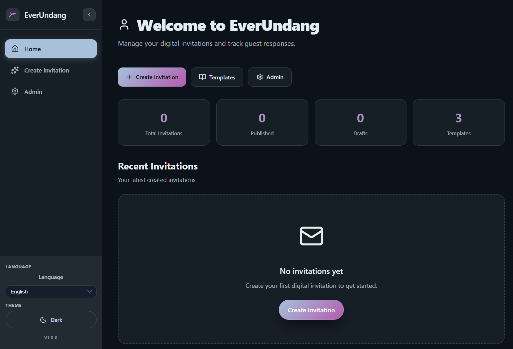
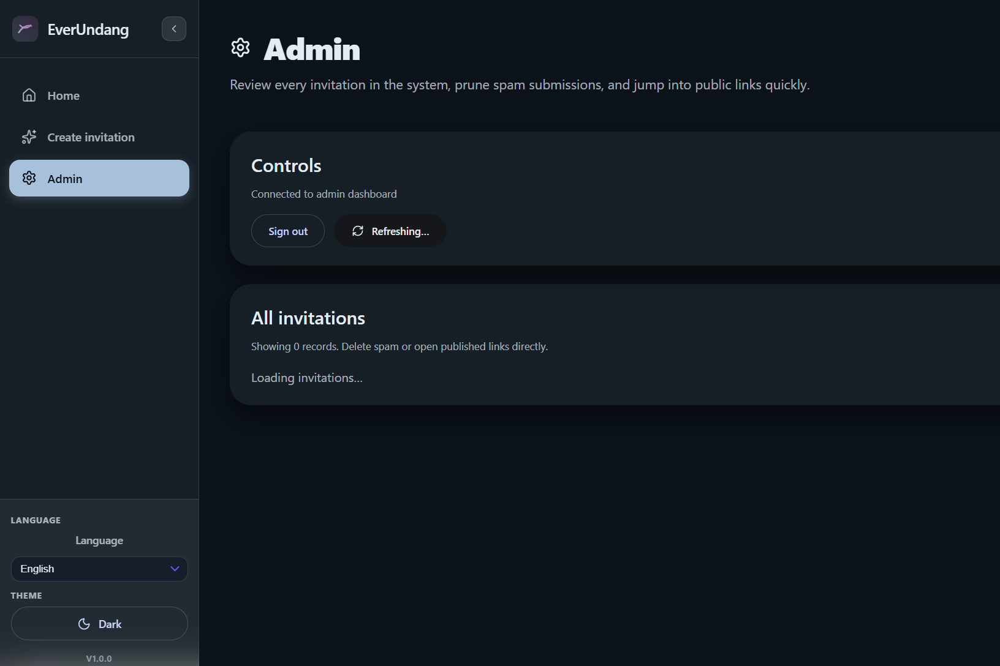

<div align="center">
  <svg width="80" height="80" viewBox="0 0 48 48" fill="none" xmlns="http://www.w3.org/2000/svg" role="img" aria-label="EverUndang logo">
    <defs>
      <linearGradient id="everundang-readme-gradient" x1="0" y1="48" x2="48" y2="0" gradientUnits="userSpaceOnUse">
        <stop stop-color="#a1c2dd" />
        <stop offset="1" stop-color="#c157b5" />
      </linearGradient>
    </defs>
    <rect width="48" height="48" rx="14" fill="url(#everundang-readme-gradient)" opacity="0.18" />
    <path d="M12 30.5C16.2 23.8 24.5 16 35 18.5" stroke="url(#everundang-readme-gradient)" stroke-width="3" stroke-linecap="round" />
    <path d="M14 17c2.5 3 5.5 5 10 5s7.5-2 10-5" stroke="url(#everundang-readme-gradient)" stroke-width="2.5" stroke-linecap="round" />
  </svg>

  <h1>EverUndang</h1>
  <p><strong>Digital invitation platform with owner tools, admin controls, RSVP workflows, and analytics.</strong></p>
</div>

## Overview

EverUndang is a full-stack web application for creating and managing digital invitations. It includes a public invitation page, owner dashboard, admin console, RSVP handling, guestbook, gift ideas, data exports, and operational tooling for containerized and Kubernetes-based deployments.

## Screenshots

### Landing Page



### Admin Dashboard



## Core Features

- Invitation creation with customizable event and couple details
- Owner dashboard for content updates, RSVP controls, guest codes, and QR actions
- Admin console for cross-invitation moderation and status management
- Public invitation page with RSVP, guestbook, and gift suggestions
- Analytics and export endpoints for operational insight and reporting
- Internationalization support (English and Indonesian)

## Tech Stack

- Frontend: React, Vite, TypeScript, TanStack Query
- Backend: Express, TypeScript, Zod
- Database: PostgreSQL
- Infra and Ops: Docker, Docker Compose, Kubernetes manifests, Prometheus, Grafana

## Architecture

```text
Frontend (React + Vite)
        |
        | REST API
        v
Backend (Express + TypeScript)
        |
        | SQL
        v
PostgreSQL
```

## Repository Structure

```text
backend/     API, business logic, DB access, scripts
frontend/    SPA, routing, UI components, i18n
k8s/         Kubernetes base manifests, overlays, monitoring
```

## Local Development

### Option 1: Run with npm

Prerequisites:

- Node.js 20+
- PostgreSQL 15+

Steps:

```powershell
# 1) Install dependencies
cd backend
npm install
cd ../frontend
npm install

# 2) Configure environment files
cd ../backend
Copy-Item .env.example .env
cd ../frontend
Copy-Item .env.example .env

# 3) Start services in separate terminals
cd ../backend
npm run dev

cd ../frontend
npm run dev
```

### Option 2: Run with Docker Compose

```powershell
docker compose up --build
```

## Environment Variables

### Backend (`backend/.env`)

- `DATABASE_URL` PostgreSQL connection string
- `ADMIN_SECRET` admin access secret
- `FRONTEND_URL` frontend URL for redirects and links
- `FRONTEND_ORIGINS` allowed CORS origins
- `INVITE_OWNER_JWT_SECRET` owner token signing secret
- `OWNER_TOKEN_TTL_SECONDS` owner token TTL in seconds

### Frontend (`frontend/.env`)

- `VITE_API_URL` backend base URL

## Build Commands

```powershell
# backend
cd backend
npm run build

# frontend
cd ../frontend
npm run build
```

## API Surface

Main route groups:

- `/api/invitations`
- `/api/analytics`
- `/api/exports`
- `/api/gifts`

## Deployment Notes

The repository includes production-oriented resources for Kubernetes and monitoring in the `k8s/` directory. You can adapt these manifests for your cluster and deployment pipeline.

## License

This project is licensed under the MIT License. See `LICENSE`.
